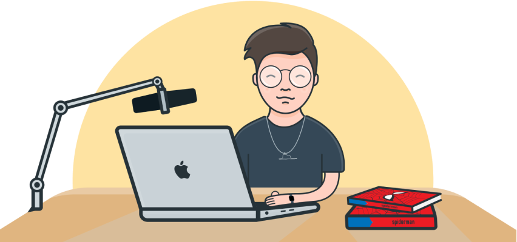

# Hi 👋🏻! I'm Eli Manrique

  

&nbsp;

## About me
- 💻 I'm a Software Engineer specialized in front-end web development with **ReactJS**, **TypeScript**, **Cypress**, **GraphQL**, and **Tailwind CSS**.
- 👤 My pronouns are `She, her, ella`.
- 🗓 Currently, I work at [@comparaonline](https://github.com/comparaonline) as an IT Manager (previously at [@ableco](https://github.com/ableco) and Grupo "El Comercio").
- 📝 I write about web development, gadgets and some personal reflections in my blog [www.nopitown.com](https://www.nopitown.com).
- 🎮 In my spare time, I like to collect Zippo lighters 🕯, read Spider-Man comics 🕷 and play the piano 🎹.
- 📧 Reach me out at hey@nopitown.com
- 🥸 As a fan fuct, I like to watch mexican soap opera (please ask me about ["Rebelde"](https://en.wikipedia.org/wiki/Rebelde) 😆).

## Languages

    
    
    
    
    
    
    

## 📕 Latest Blog Posts
<!-- BLOG-POST-LIST:START -->
- [React Miami Conf 2022](https://nopitown.com/react-miami-conf-2022/)
- [Creando un To Do app con Remix](https://nopitown.com/creando-un-to-do-app-con-remix/)
- [Core Web Vitals: LCP](https://nopitown.com/learnings-about-core-web-vitals-lcp/)
- [#Wrapped2021: 5 cosas que hice diferente](https://nopitown.com/wrapped-2021-5-cosas-que-hice-diferente/)
- [My 2020 favorite gadgets](https://nopitown.com/my-2020-favorite-gadgets/)
<!-- BLOG-POST-LIST:END -->

➡️ [more blog posts...](https://nopitown.com)
